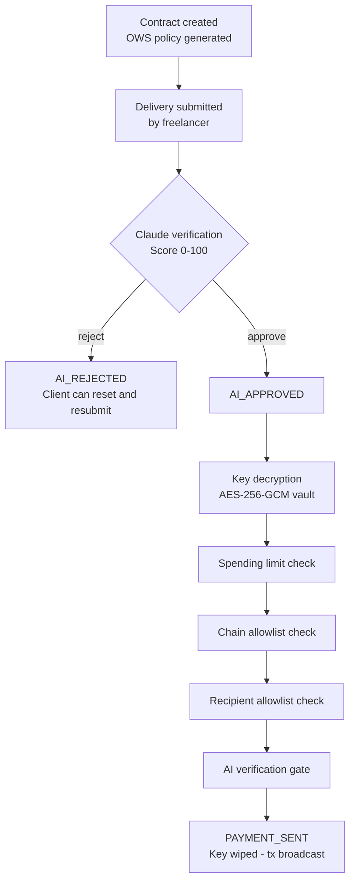

# WalletWitness

**Trustless escrow for the agentic economy, built on the Open Wallet Standard.**

Freelance work has a trust problem. The client won't pay until the work is done. The freelancer won't finish the work until payment is guaranteed. Platforms like Upwork or Fiverr solve this with a middleman - but that middleman takes 20%, moves slowly, and makes decisions based on incomplete information.

WalletWitness removes the middleman entirely. A contract is created on-chain. The freelancer submits their delivery. Claude reads the contract, reads the delivery, and decides whether the work matches what was agreed. If it does, the OWS policy engine verifies the transaction against five independent rules, and payment is executed automatically. Start to finish, under 30 seconds. No human in the loop. No fee. No dispute process.

> Built for the OWS Hackathon - April 2026.

---

## Why This Matters

The freelance market is worth over $1.5 trillion globally. A huge portion of that value is currently locked behind trust gaps - clients who won't commit funds upfront, freelancers who've been burned by non-payment, platforms that profit from exactly this friction.

Smart contract escrow has tried to solve this before, but it hits a wall the moment work quality needs to be evaluated. A smart contract can check whether a wallet address matches. It cannot read a 12-page audit report and decide whether it meets the contract requirements. That gap - between rule-checking and judgment - is where every on-chain escrow solution has failed.

WalletWitness bridges that gap. Claude handles the judgment. OWS handles the enforcement. Neither can act without the other.

---

## How It Works

The system runs as three layers stacked on top of each other. Each layer has a single job, and no layer can bypass the one below it.

**Layer 1 - AI Verification**

When a freelancer submits their delivery, the full text goes to Claude alongside the original contract description. Claude isn't just checking keywords - it's reading both documents and producing a structured verdict: a match score from 0 to 100, a list of requirements that were met, a list of requirements that were missed, and a final recommendation of APPROVE, REJECT, or REQUEST_MORE_INFO. If the score falls below the threshold, payment stops here. The contract enters a rejected state and the client can reset it for resubmission.

**Layer 2 - OWS Policy Engine**

If Claude approves, the transaction doesn't go out immediately. First it passes through an OWS-compatible policy engine that evaluates five independent rules in sequence: spending limit, chain allowlist, recipient allowlist, time restriction, and AI verification gate. All five must pass. If any single rule fails - wrong chain, wrong recipient, expired deadline, missing AI approval - the signing process is denied before any key is ever touched.

**Layer 3 - OWS Signing**

Only after all five policy rules pass does the signing flow begin. The private key is decrypted from an AES-256-GCM vault, the transaction is signed in an isolated process, and the key is wiped from memory the moment signing completes. The key never appears in the Express server process, never reaches the Claude API, never touches the browser. The signed transaction is what gets broadcast - not the key.

---

## Flow



---

## OWS Integration in Detail

WalletWitness is built around three OWS primitives.

**Policy Engine**

Every contract automatically generates a fully OWS-compatible policy JSON at creation time. The policy is bound to that specific contract - its amount, its chain, its recipient wallet, its deadline - and cannot be modified after creation. Five rule types are enforced:

- `spending_limit` - maximum payment amount, one-time, hard cap
- `chain_allowlist` - signing restricted to the CAIP-2 chain identifier specified in the contract
- `recipient_allowlist` - payment can only be sent to the freelancer wallet registered at contract creation
- `time_restriction` - signing window opens at contract creation and closes at the agreed deadline
- `require_ai_verification` - signing is blocked until Claude has returned an approved status for this specific contract

The policy JSON produced by WalletWitness is fully compatible with the OWS policy engine specification and can be passed directly to a real OWS signer without modification.

**Signing Interface**

The signing flow mirrors the OWS specification step by step:

1. Policy engine evaluates all five rules - any failure stops the process here
2. Key is decrypted from the AES-256-GCM vault at `~/.ows/wallets/`
3. Transaction is signed in an isolated process
4. Key is wiped from memory immediately after signing
5. Signed transaction is returned - the private key was never exposed at any point

**Audit Log**

Every event in the contract lifecycle is written to an append-only audit log following the OWS audit specification. The log cannot be modified retroactively. Events: `CONTRACT_CREATED`, `DELIVERY_SUBMITTED`, `AI_VERIFICATION_APPROVED`, `AI_VERIFICATION_REJECTED`, `PAYMENT_EXECUTED`, `CONTRACT_RESET`.

---

## Architecture

```
Client Browser (index.html)
        |
        | HTTP REST
        v
WalletWitness Backend (Express.js)
        |
        |- OWS Policy Builder   (generates OWS-compatible policy JSON per contract)
        |- Claude API           (delivery verification - demo mode if no key provided)
        |- OWS Signing Flow     (key decrypt -> policy eval -> sign -> wipe)
        |- Append-only Audit Log
        |
        v
  ~/.ows/wallets/ (AES-256-GCM vault)
```

---

## Quick Start

Requirements: Node.js 18+

**1. Clone and install:**

```bash
git clone https://github.com/Lethe044/walletwitness
cd walletwitness/backend
npm install
```

**2. Configure environment:**

```bash
cp .env.example .env
# Add your ANTHROPIC_API_KEY (optional - see below)
```

If no API key is provided, the system runs in demo mode. The AI verification step uses a keyword-matching simulation instead of real Claude analysis. Every other part of the system - policy engine, signing flow, audit log - runs identically to production mode. Demo mode is intentional and documented; it lets anyone run the full end-to-end flow without an API account.

**3. Start the backend:**

```bash
npm start
```

Server starts on `http://localhost:3001`.

**4. Open the frontend:**

Open `frontend/index.html` directly in your browser. No build step, no bundler, no dependencies to install.

---

## API Reference

| Method | Endpoint | Description |
|--------|----------|-------------|
| GET | `/api/health` | Health check |
| POST | `/api/contracts` | Create a new escrow contract |
| GET | `/api/contracts` | List all contracts |
| GET | `/api/contracts/:id` | Get single contract |
| POST | `/api/contracts/:id/deliver` | Submit delivery for AI verification |
| GET | `/api/contracts/:id/audit` | Get full audit log |
| GET | `/api/contracts/:id/policy` | Get OWS policy JSON |
| POST | `/api/contracts/:id/reset` | Reset a rejected contract for resubmission |

**Create Contract - Request Body:**

```json
{
  "title": "Smart contract audit for DeFi protocol",
  "description": "Audit 3 Solidity contracts, produce a written report with findings categorized by severity. Minimum 5 pages.",
  "amount": "1500.00",
  "chain": "eip155:8453",
  "clientWallet": "0xABC...123",
  "freelancerWallet": "0xDEF...456",
  "deadline": "2026-04-10T23:59:00Z"
}
```

**OWS Policy JSON - Example Output:**

```json
{
  "id": "uuid-v4",
  "name": "escrow-policy-uuid",
  "version": "1.0.0",
  "rules": [
    { "type": "spending_limit", "maxAmountUsd": 1500, "period": "one_time", "action": "deny_if_exceeded" },
    { "type": "chain_allowlist", "allowedChains": ["eip155:8453"], "action": "deny_if_not_in_list" },
    { "type": "recipient_allowlist", "allowedAddresses": ["0xDEF...456"], "action": "deny_if_not_in_list" },
    { "type": "time_restriction", "notBefore": "2026-04-03T...", "notAfter": "2026-04-10T...", "action": "deny_if_outside_window" },
    { "type": "require_ai_verification", "verificationStatus": "must_be_approved", "action": "deny_if_not_verified" }
  ]
}
```

---

## Contract States

```
AWAITING_DELIVERY
      |
      | (freelancer submits)
      v
  VERIFYING
      |
      |- (Claude approves) -> AI_APPROVED -> PAYMENT_SENT
      |
      |- (Claude rejects)  -> AI_REJECTED
                                  |
                                  | (client resets)
                                  v
                          AWAITING_DELIVERY
```

---

## Security

- Wallet addresses are validated against EVM format before any contract is created
- Payment amount is bounds-checked between 0 and 1,000,000
- All user input is sanitized before rendering in the UI
- All five OWS policy rules must pass before signing begins - a single failure stops the process
- The private key is decrypted only inside the signing step, wiped immediately after, and never appears in any other process, log, API call, or browser context
- Delivery text sent to Claude contains only the contract description and the freelancer's submission - no keys, no wallet data, no transaction details

---

## Built With

- [Open Wallet Standard (OWS)](https://openwallet.foundation/) - Policy engine, signing interface, audit log specification
- [Claude (Anthropic)](https://www.anthropic.com) - Delivery verification and contract analysis
- Express.js - REST API backend
- Vanilla JS + IBM Plex Mono + Syne - Frontend, zero framework dependencies

---

## Hackathon Submission

This project was built for the OWS Hackathon, April 2026.

The thesis is simple: the missing piece in trustless freelance payments has never been the payment rail. It's been the judgment layer. Blockchains are excellent at enforcing rules. They're useless at reading a design brief and deciding whether a delivered logo matches it. That's a language problem, not a computation problem.

OWS gives us the enforcement infrastructure. Claude gives us the judgment layer. Put them together and you get something that hasn't existed before: an escrow agent that can actually read the contract.

The policy engine replaces on-chain logic. The signing interface replaces multi-sig setups. The audit log replaces block explorers. Claude replaces the mediator. And the freelancer gets paid the moment the work is done - not when a platform support ticket gets resolved, not when a human arbitrator gets around to it.

Every agent deserves a wallet. Every freelancer deserves to get paid without asking permission.
